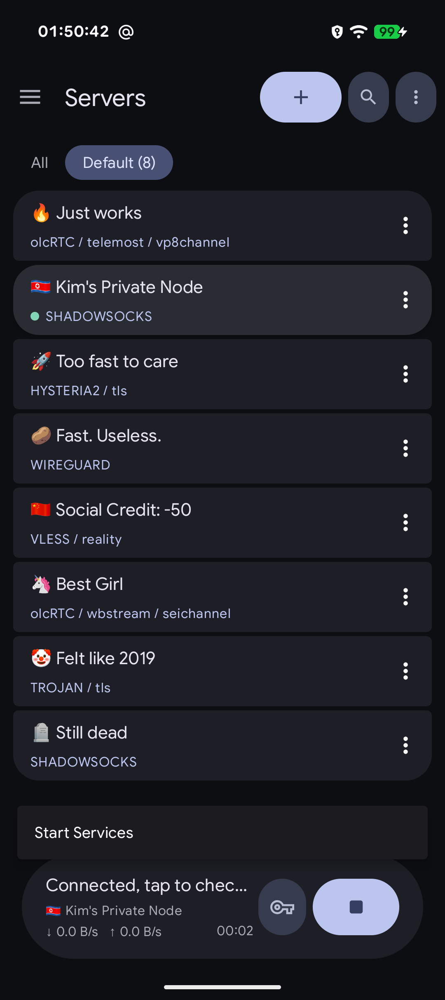
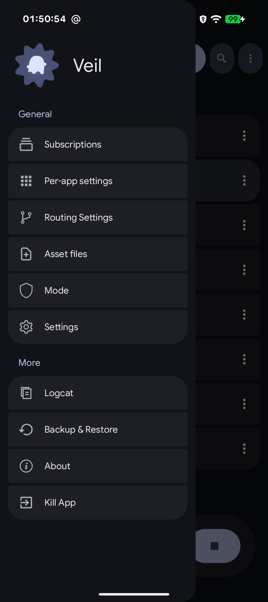
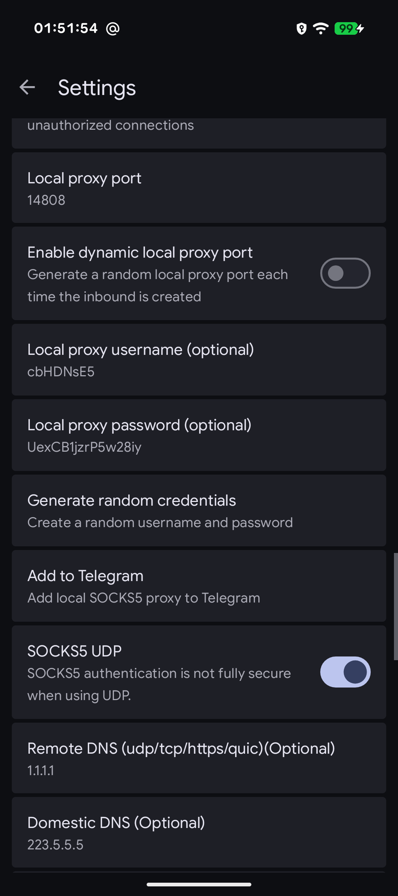
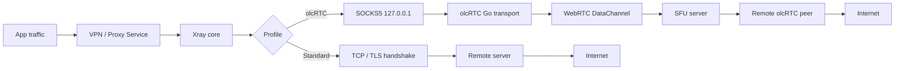

### Veil

**A V2Ray / Xray client for Android** — Material 3, olcRTC tunnel, built for privacy.

<br clear="left"/>

<p align="center">
  <a href="https://developer.android.com/about/versions/nougat"></a>
  <a href="https://kotlinlang.org"></a>
  <a href="LICENSE"></a>
</p>

<p align="center">
  <a href="https://github.com/venterum/veil/releases"><b>Download latest APK</b></a>
  &nbsp;&middot;&nbsp;
  <a href="https://apps.obtainium.imranr.dev/redirect.html?r=obtainium://add/https://github.com/venterum/veil">Obtainium</a>
  &nbsp;&middot;&nbsp;
  <a href="#screenshots">Screenshots</a>
  &nbsp;&middot;&nbsp;
  <a href="#features">Features</a>
  &nbsp;&middot;&nbsp;
  <a href="#building-from-source">Build</a>
  &nbsp;&middot;&nbsp;
  <a href="#migrating-from-v2rayng">Migrate</a>
</p>

---

> **Beta software.** Veil is in early active development. Bugs, crashes, and breaking changes are expected. Use at your own risk, and please <a href="https://github.com/venterum/veil/issues">report any issues</a> you run into.

Veil is a privacy-focused proxy client forked from <a href="https://github.com/2dust/v2rayNG">v2rayNG</a>. It keeps full compatibility with standard V2Ray/Xray protocols while adding an **olcRTC** transport layer that tunnels traffic via encrypted WebRTC data channels.

---

## Screenshots

<p align="center">
  <kbd>
    
    <br>
    <sub><b>Home</b></sub>
  </kbd>
  &nbsp;&nbsp;
  <kbd>
    
    <br>
    <sub><b>Panel</b></sub>
  </kbd>
  &nbsp;&nbsp;
  <kbd>
    
    <br>
    <sub><b>Settings</b></sub>
  </kbd>
  &nbsp;&nbsp;
  <kbd>
    
    <br>
    <sub><b>olcRTC + Details</b></sub>
  </kbd>
</p>

---

## Features

### Protocols
VMess, VLESS, Shadowsocks, Trojan, SOCKS, WireGuard, Hysteria2

### olcRTC tunnel
Encrypted TCP-over-WebRTC with pluggable carriers:
- **Carriers:** Jitsi, Telemost, WbStream
- **Transports:** DataChannel, VP8, SEI

### Connection modes
- **VPN** — full-device TUN tunnel
- **Proxy** — SOCKS5 only, no TUN
- **Hybrid** — SOCKS5 + optional in-app TUN toggle

### Subscriptions & Import
- Subscription management
- QR-code import / export

### Routing & Privacy
- Per-app proxy
- Custom routing rules
- DNS settings
- GeoIP / Geosite support

### Advanced
- Traffic fragmentation
- Multiplexing (mux)
- Split-tunneling
- Home-screen widget

---

## Architecture



### Core integration

The Xray core and olcRTC transport are compiled into a **single `libv2ray.aar`** via gomobile:

| Go module | Package | Role |
|---|---|---|
| `github.com/2dust/AndroidLibXrayLite` | `libv2ray.*` | Xray core (routing, protocols, DNS) |
| `olcrtc/mobile` | `mobile.*` | olcRTC WebRTC transport (SOCKS5 server) |

Both modules are unmodified. They share one process (`:RunSoLibV2RayDaemon`) and communicate via loopback SOCKS5.
For standard protocols Xray connects directly to the remote server. For olcRTC profiles, Xray routes traffic through the local olcRTC SOCKS5 proxy which tunnels it via WebRTC.

---

## Project Layout

```
.
├── veil/                     # Android application (Gradle project)
│   └── app/
│       ├── src/main/java/com/v2ray/ang/core/OlcrtcManager.kt
│       ├── src/main/java/com/v2ray/ang/fmt/OlcrtcFmt.kt
│       ├── src/main/java/com/v2ray/ang/ui/OlcrtcActivity.kt
│       └── ...
├── olcrtc/                  # git submodule — olcRTC Go transport
├── hev-socks5-tunnel/       # git submodule — native TUN tunnel
├── AndroidLibXrayLite/      # git submodule — Go sources for Xray core bindings
├── compile-hevtun.sh        # builds the native libhev-socks5-tunnel libraries
├── compile-libv2ray.sh      # builds the combined libv2ray.aar (Xray + olcRTC)
└── README.md
```

---

## Building from Source

### Requirements

| Tool | Version |
|---|---|
| JDK | 17+ |
| Android SDK | `platforms;android-37`, `build-tools;37.0.0`, `platform-tools` |
| Android NDK | Required for the native TUN tunnel |
| Go + gomobile | Go 1.26+; `go install golang.org/x/mobile/cmd/gomobile@latest && gomobile init` |

### Steps

1. **Clone** (with all submodules)

   ```bash
   git clone --recurse-submodules https://github.com/venterum/veil
   ```

2. **Build `hev-socks5-tunnel` native libraries**

   ```bash
   export NDK_HOME=$ANDROID_HOME/ndk/<ndk-version>
   bash compile-hevtun.sh
   cp -r libs veil/app/
   ```

3. **Build the combined `libv2ray.aar`** (Xray core + olcRTC in one AAR)

   ```bash
   export ANDROID_HOME=/path/to/android-sdk
   export ANDROID_NDK_HOME=$ANDROID_HOME/ndk/<ndk-version>
   bash compile-libv2ray.sh
   ```

   The resulting AAR contains:
   - `libv2ray.*` — Xray core bindings from `AndroidLibXrayLite`
   - `mobile.*` — olcRTC Go transport via gomobile
   - `libgojni.so` — native Go binary for all ABIs (`arm64-v8a`, `armeabi-v7a`, `x86`, `x86_64`)
   - `geoip.dat`, `geosite.dat` — routing rule assets

4. **Build the APK**

   ```bash
   echo "sdk.dir=$ANDROID_HOME" > veil/local.properties
   cd veil
   ./gradlew assembleDebug
   ```

   APK outputs: `veil/app/build/outputs/apk/debug/`, split per ABI.

---

## Migrating from v2rayNG

Veil is a fork of [v2rayNG](https://github.com/2dust/v2rayNG) and shares its config format, so migration is seamless (available since Veil 2.0.x):

1. Open v2rayNG → side drawer → **Backup & Restore** → **Backup config** → **Local**
2. Transfer the saved config files to this device
3. Open Veil → side drawer → **Backup & Restore** → **Restore config** → **Local**, select the file

Standard protocol profiles (VMess, VLESS, Shadowsocks, Trojan, SOCKS, WireGuard, Hysteria2), subscriptions, and settings are fully compatible. olcRTC-specific profiles only work in Veil.

Full documentation (EN / RU) is available in the [docs](docs/index.md) directory.

---

## Legal Notice

> **Read before using this software.**

This software is provided for **lawful use only**. By downloading, installing, or using Veil you agree to the following:

1. Laws governing the use of VPN clients, proxy tools, and privacy software vary significantly by country and region. **It is solely your responsibility** to ensure your use of this software complies with all applicable local, national, and international laws and regulations.

2. Using Veil to connect to third-party VPN/proxy servers does not make the author responsible for the policies, practices, or legal status of those services. You remain solely responsible for your choice of servers and the traffic you route through them.

> I do not endorse or encourage any illegal activity. **Use responsibly.**

---

## Credits

| Project | Author | Role |
|---|---|---|
| [v2rayNG](https://github.com/2dust/v2rayNG) | 2dust | Upstream project this fork is based on |
| [Xray-core](https://github.com/XTLS/Xray-core) / [v2ray-core](https://github.com/v2fly/v2ray-core) | XTLS / v2fly | Core proxy engine |
| [hev-socks5-tunnel](https://github.com/heiher/hev-socks5-tunnel) | heiher | Native TUN→SOCKS5 tunnel |
| [olcRTC](https://github.com/openlibrecommunity/olcrtc) | openlibrecommunity | WebRTC-based encrypted transport |
| [Google Sans / Google Sans Flex](https://fonts.google.com/specimen/Google+Sans) | Google | Typeface (SIL OFL 1.1) |

---

## License

This project is licensed under the **GNU General Public License v3.0**.
See [LICENSE](LICENSE) for the full text.
